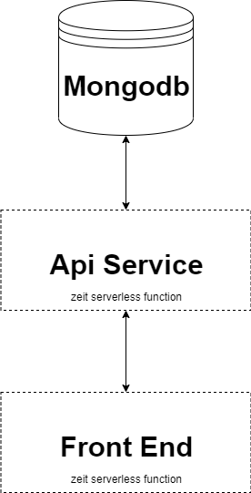

# Current Stack
1. Node.js
2. Apollo Graphql Server for api serverless functions with zeit.now.sh
3. Docker for containerization
4 Next.js for react server side rendering
5. Twilio for notifications
6. JWT Tokens for stateless authentication and authorization
7. Typescript for javascript static type checking
8. zeit.co for serverless hosting.

This codebase is divided into two:
/api (for backend logic)
/frontend (for the frontend client)



These folders have seperate sets of dependencies (As indicated with the package.json file at the root)

### **Node.js must be installed to work on this code.**

# /api

To startup the api service run the following commands:


1. ```cd api``` (From the root directory) 
2. ```npm install``` (install npm dependencies)
3. ```npm install -g typescript``` (install typescript as a global dependency)
4. ```npm run dev``` (This would startup a server on localhost)

```/src/index.ts``` is the entry point

The api server is a graphql server, you'll need to understand how graphql works and how to create a graphql server using apollo graphql (https://www.apollographql.com/)

Files & Directories Explanation:
./datamodel.graphql - used for faunadb schema definition (https://www.fauna.com)
./graphqlgen.yml - used to generate the graphql server resolver typings
./prisma.yml - used to generate typescript code for directly interfacing with the database

# /frontend

The frontend code uses react with next.js for server-side rendering.

To startup the react frontend run the following commands

1. ```cd frontend```
2. ```npm install```
3. ```npm run dev``` 


# Contribution Notes

Changes to the code should be made through pull requests.

To start contributing:
1. Fork the repo on github
2. Clone the forked repo to your computer
3. run command in the folder: ```git remote add upstream https://github.com/scroobius-pip/zanga.git ```
4. Make any changes to the code. And commit the code.
5. Create a pull request on github
6. Wait for the pull request to be accepted

To sync latest changes from the origin repo, run the following commands in the project folder:

1. ```git fetch upstream```
2. ```git checkout master```
3. ```git merge upstream/master```
